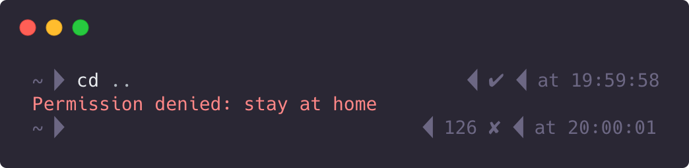

# Stay At Home

This shell script makes sure you **stay at home**, safely.

## 💡 Credits
This project is a implementation of the [Stay at home everyone](https://www.reddit.com/r/ProgrammerHumor/comments/fo5h8h/stay_at_home_everyone/) meme from somebody in Reddit, which I guess got spread later to [Twitter](https://twitter.com/pr0grammerhum0r/status/1242496426258522112) and other communities. -Without the the r-word, of course.

## 🚀 Usage
Add the function in the file **[stay-at-home.sh](./stay-at-home.sh)** to your shell's **RC file**, restart your terminal for refresh, and you'll stay safe in your home!
